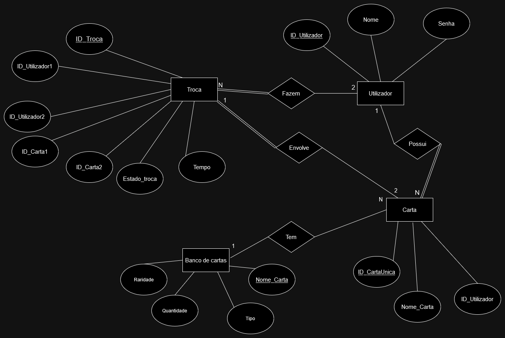
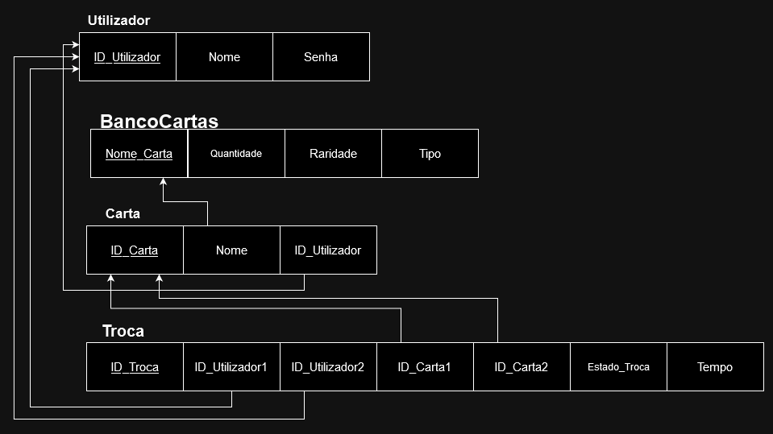
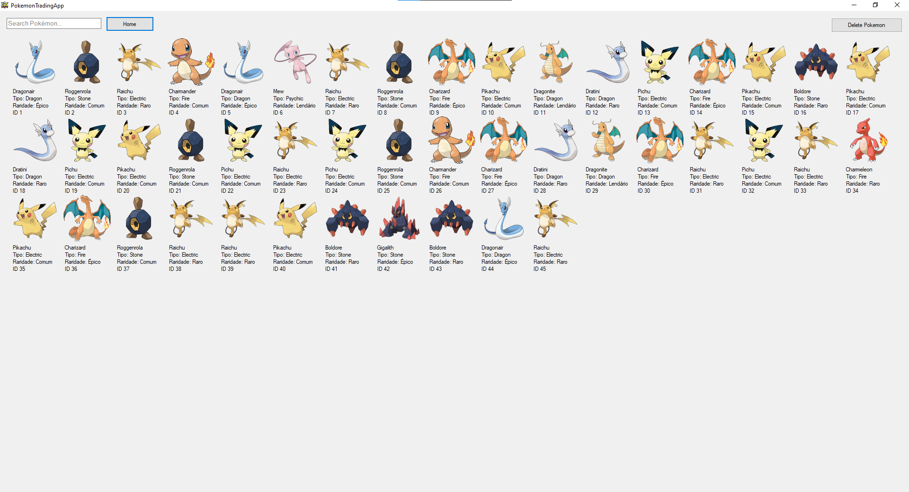
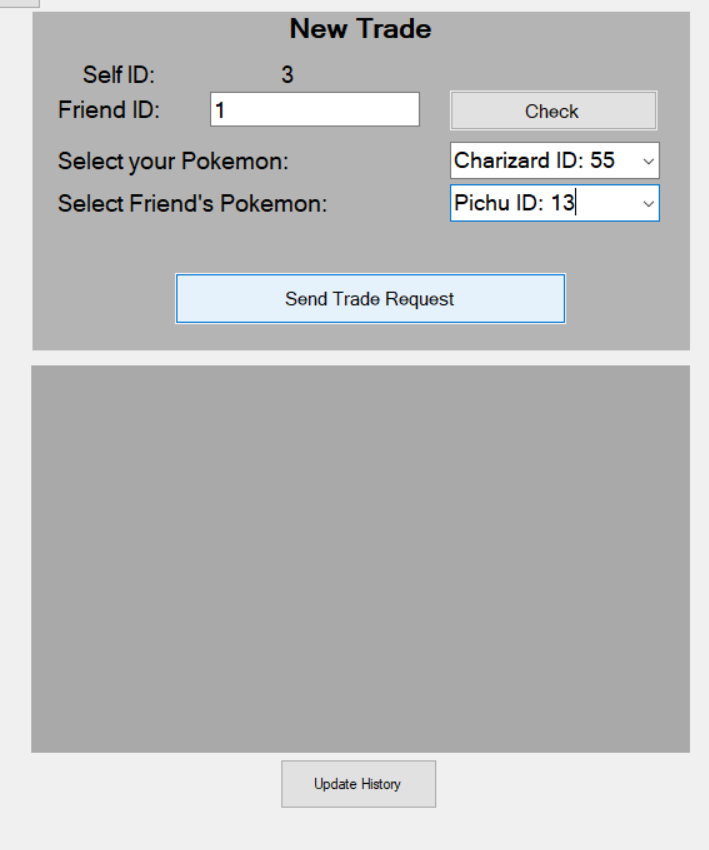
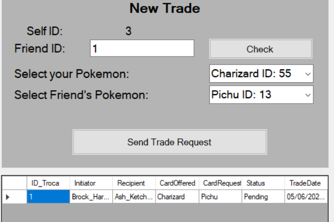

# BD: Trabalho Prático APF-T

**Grupo**: P7G5
- Simão Ildefonso, NMEC: 107997
- Michael Cerqueira, NMEC: 108732


---
## Introdução
 
O nosso projeto é uma aplicação de Pokémon que permite aos utilizadores colecionarem Pokémon e fazerem trocas entre si. Esta app é bastante boa para quem gosta de fazer coleções e vê competição nas mesmas (neste caso obter os pokemons com os ids mais baixos pois são os mais raros/os primeiros a serem colecionados).

## ​Análise de Requisitos

### Requisitos Funcionais

Os utilizadores devem poder se registar na aplicação fornecendo um nome de utilizador e uma palavra-passe.
Os utilizadores devem poder fazer login na aplicação com as suas credenciais registadas.


Os utilizadores devem poder visualizar todas as cartas Pokémon disponíveis.
Os utilizadores devem poder adicionar cartas à sua coleção pessoal.
Os utilizadores devem poder remover cartas de sua coleção pessoal.


Os utilizadores devem poder visualizar outros utilizadores disponíveis para troca.
Os utilizadores devem poder propor uma troca de cartas com outros utilizadores.
Os utilizadores devem poder aceitar ou rejeitar propostas de troca de cartas.
Requisitos 
### Requisitos Não Funcionais 


A aplicação deve ser rápida e responsiva, mesmo com um grande número de cartas e utilizadores.


A aplicação deve ser capaz de lidar com um aumento no número de utilizadores e cartas sem comprometer o desempenho.

## DER - Diagrama Entidade Relacionamento

### Versão final



### APFE 

Depois da entrega intermedia, alteramos a estrutura da nossa base de dados. Agora não temos uma collection e decidimos adicionar um banco de cartas que possui todas as cartas disponíveis para o utilizador obter.

## ER - Esquema Relacional

### Versão final



### APFE

Atualmente, as cartas estão associadas a um ID do utilizador. O banco de cartas também guarda as características de cada carta, como raridade e tipo. Apenas quando o utilizador abre um pack é que a carta se torna única, ganhando um ID unico. No caso de se abrir um pack, a quantidade da carta que o utilizador ganhou é subtraida em uma unidade no banco de cartas, o contrário também acontece quando o utilizador descarta uma carta.
Também adicionamos o tempo nas trocas, para o utilizador ter acesso a quando realizou a mesma.

## ​SQL DDL - Data Definition Language

[SQL DDL File](sql/01_ddl.sql "SQLFileQuestion")

## SQL DML - Data Manipulation Language

Uma secção por formulário.


### Formulario exemplo


Neste caso, implementamos um Stored Procedure que serve para mostrar todas as cartas do utilizador atual, no formulário .

```sql
-- Show data on the form
SELECT ID_CartaUnica, Nome_Carta FROM PokemonApp.Carta WHERE ID_Utilizador = @UserID;
```
Antes de o utilizador clicar no botão:

Depois de clicar no botão:


Neste caso, também utilizamos um Stored Procedure para quando o utilizador criar uma troca com outro utilizador, esta ser guardada na base de dados. 
```sql
-- Insert new element
INSERT INTO PokemonApp.Troca (ID_Utilizador1, ID_Utilizador2, ID_CartaUnica1, ID_CartaUnica2, Estado_Troca, Tempo)
```


## Normalização

No nosso projeto, a normalização é fundamental para garantir a integridade e eficiência dos dados.
Passos de Normalização

    Primeira Forma Normal (1NF):
        Eliminação de Grupos Repetitivos: Certificamos que todas as tabelas (Utilizador, Carta, BancoCartas, Troca) contêm apenas valores atômicos, ou seja, cada campo contém apenas valores únicos e indivisíveis. Isso impede qualquer forma de múltiplos valores em uma única coluna, simplificando o acesso e a manipulação dos dados.

    Segunda Forma Normal (2NF):
        Remoção de Dependências Parciais: Asseguramos que cada atributo da tabela é dependente da chave inteira, não apenas de uma parte dela. Isso é crucial, especialmente em tabelas onde a chave primária é composta, como na tabela Troca, onde a chave é composta por ID_Troca e todas as informações são diretamente dependentes desta chave.

    Terceira Forma Normal (3NF):
        Remoção de Dependências Transitivas: Cada atributo não chave deve depender apenas das chaves primárias e não de outros atributos não chave. Por exemplo, a separação de BancoCartas e Carta assegura que alterações nas características de uma carta não afetem diretamente os usuários ou as trocas.

Justificação para as Escolhas de Normalização

    Redução de Dados Duplicados: Ao dividir os dados em tabelas mais especializadas e ao manter relações estritas entre elas, reduzimos a duplicação de dados. Isto não economiza apenas espaço de armazenamento mas também simplifica manutenções e atualizações.

    Integridade dos Dados: A normalização ajuda a manter a consistência dos dados ao longo do tempo. Ao garantir que as modificações sejam feitas em um local centralizado, evitamos inconsistências que poderiam surgir ao atualizar múltiplas cópias dos mesmos dados em locais diferentes.

    Desempenho de Consultas: Com a normalização e a criação de índices específicos, as consultas são mais eficientes, pois o sistema precisa processar menos dados duplicados e as buscas são aceleradas pelos índices.
    
## Índices

```sql
-- Procurar o nome de utilizadores nos utilizadores 
CREATE INDEX IDX_Utilizadores_Nome ON PokemonApp.Utilizadores (Nome);
-- Procurar Nome,tipo e raridade no banco de cartas
CREATE INDEX IDX_BancoCartas_Nome_Tipo_Raridade ON PokemonApp.BancoCartas (Nome_Carta, Tipo, Raridade);
-- Procurar o nome das Cartas na tabela Cartas
CREATE INDEX IDX_Carta_Nome_Carta ON PokemonApp.Carta (Nome_Carta);
--Procurar utilizadores nas trocas
CREATE INDEX IDX_Troca_Utilizadores ON PokemonApp.Troca (ID_Utilizador1, ID_Utilizador2);
```

## SQL Programming: Stored Procedures, Triggers, UDF
[UDF File](sql/02_UDF.sql "SQLFileQuestion")

[SQL SPs and Functions File](sql/03_sp_functions.sql "SQLFileQuestion")

[SQL Triggers File](sql/04_triggers.sql "SQLFileQuestion")


## Outras notas
Quando inserimos uma nova password na base de dados, é acionado um trigger que encripta automaticamente a mesma. O trigger utiliza uma função hash para este efeito. Isto permite-nos inserir manualmente passwords na base de dados com o comando INSERT INTO e também adicionar automaticamente a password quando os utilizadores estiverem a criar uma conta nova.

### Dados iniciais da dabase de dados/Database init data

[Indexes File](sql/01_ddl.sql "SQLFileQuestion")

[DB Data](sql/05_db_init.sql "SQLFileQuestion")


 