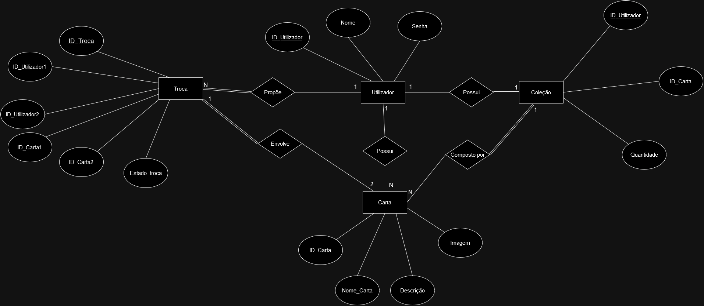
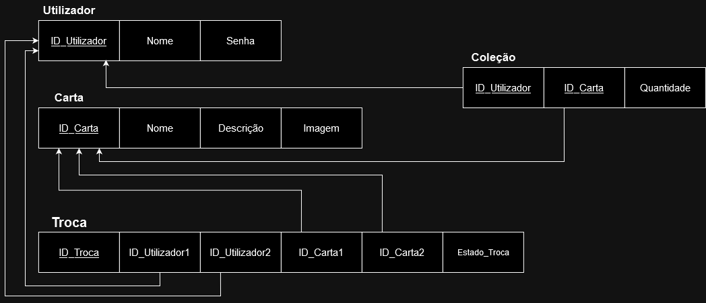

# Levantamento de Requisitos - Aplicação de Gestão de Cartas Pokémon

## Descrição do Projeto
O objetivo deste projeto é desenvolver uma aplicação que permita aos utilizadores colecionar e trocar cartas Pokémon. A aplicação deve fornecer uma interface intuitiva e fácil de usar, permitindo que os utilizadores visualizem, adicionem, removam e troquem cartas Pokémon.

## Requisitos Funcionais
1. Registo de Utilizadores:
    - Os utilizadores devem poder se registar na aplicação fornecendo um nome de utilizador e uma palavra-passe.
    - Os utilizadores devem poder fazer login na aplicação com as suas credenciais registadas.

2. Gerenciamento de Cartas:
    - Os utilizadores devem poder visualizar todas as cartas Pokémon disponíveis.
    - Os utilizadores devem poder adicionar cartas à sua coleção pessoal.
    - Os utilizadores devem poder remover cartas de sua coleção pessoal.

3. Troca de Cartas:
    - Os utilizadores devem poder visualizar outros utilizadores disponíveis para troca.
    - Os utilizadores devem poder propor uma troca de cartas com outros utilizadores.
    - Os utilizadores devem poder aceitar ou rejeitar propostas de troca de cartas.

## Requisitos Não Funcionais

1. Desempenho:
    - A aplicação deve ser rápida e responsiva, mesmo com um grande número de cartas e utilizadores.

2. Escalabilidade:
    - A aplicação deve ser capaz de lidar com um aumento no número de utilizadores e cartas sem comprometer o desempenho.

## Diagramas

